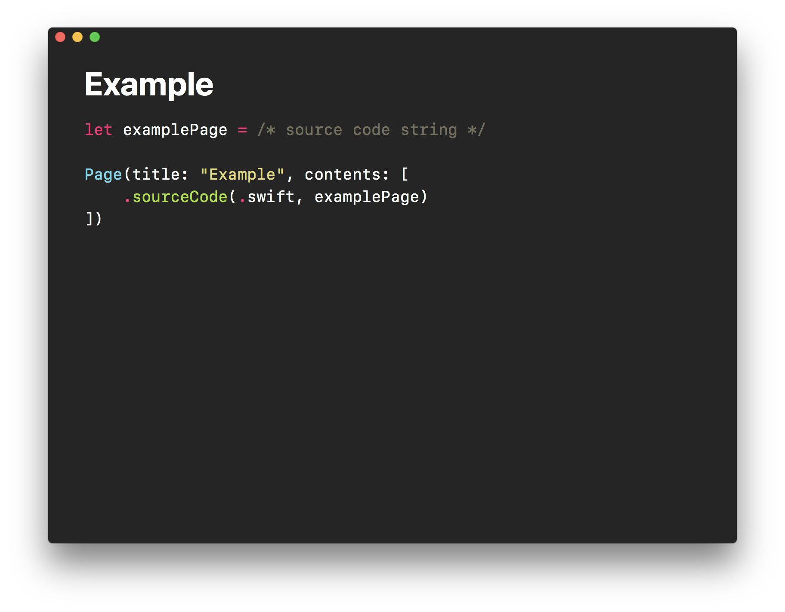

# Truffaut

A humble tool to help you presenting ideas by writing Swift



## Requirements

- **macOS 10.13**, could also work on earlier versions as long as Xcode 9 works
- **Xcode 9**, the embedded `swiftc` will be used to interpret the slides manifest file
- Ruby gem [**rouge**](https://github.com/jneen/rouge), this gem will be used to provide syntax highlighting for source code blocks

## Usage

### Get Truffaut.app

Clone this repo or download the pre-built app [here](https://github.com/Codezerker/Truffaut/releases/download/0.6.1/Truffaut.app.zip).

### Create slides manifest

Create a Swift file:

```sh
$ touch slides.swift
```

Import the supporting module:

```swift
import TruffautSupport
```

Initialize a presentation with pages:

```swift
let presentation = Presentation(pages: [
  Page(title: "Hello World", subtitle: "A Swift Slide"),
])
```

### `TruffautSupport` API Reference

For a full reference of the `TruffautSupport` supporting module, please check [here](Documentations/TruffautSupport-API-Reference.md).

### Examples

For real-life examples of Truffaut slides, please check [this repo](https://github.com/CocoaHeads-Auckland/wellington-mobile-refresh-2017) or [this repo](https://github.com/CocoaHeads-Auckland/talk-unicode).

## Caveats and Known Issues

- Currently the syntax highlighter is assuming ruby is installed at path `/usr/local/bin/ruby` which is usually true if the ruby is intalled with [homebrew](https://brew.sh/).
  - If this is not true for you, you can modify the ruby path in the preference (`⌘ + ,`).
- Export to PDF is not implemented.
